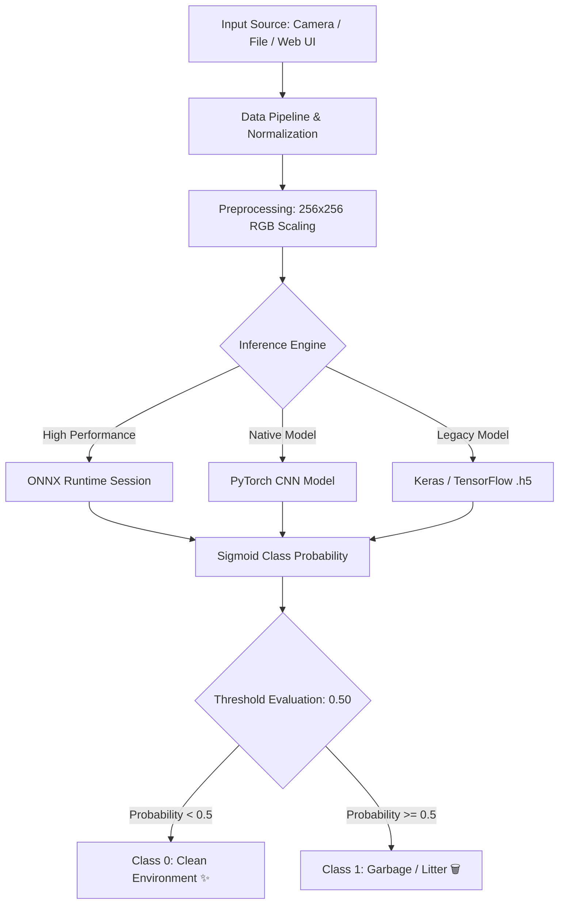

# 🌿 EcoVision AI: Binary Image Classifier

[](https://python.org)
[](https://pytorch.org)
[](https://onnxruntime.ai)
[](https://fastapi.tiangolo.com)
[](LICENSE)
[](https://github.com/Pranav-14/Binary-Image-Classifier)

> **Urban Sanitation & Environmental Intelligence**: High-performance binary image classification system engineered to detect **Clean Environments vs. Litter / Garbage Accumulation** in public spaces. Featuring PyTorch CNN architecture, ONNX Runtime acceleration, interactive Glassmorphism Web UI, FastAPI microservice, and a CLI tool.

---

## 🌟 Key Features

- ⚡ **Multi-Backend Inference Engine**: Native support for **ONNX Runtime**, **PyTorch**, and **TensorFlow / Keras** `.h5` models with automatic fallback.
- 🎨 **Glassmorphism Web Dashboard**: Modern UI with drag-and-drop file upload, live visual confidence gauge, real-time metrics display, and preset test samples.
- 🚀 **FastAPI Microservice**: High-throughput REST API with single image `/predict` and bulk `/predict-batch` endpoints.
- 💻 **Rich CLI Tool**: Terminal command interface with formatted summary tables for individual images and directory scans.
- 🐳 **Docker Ready**: Pre-configured multi-stage `Dockerfile` for seamless deployment.

---

## 🏗️ System Architecture



---

## 🚀 Quick Start Guide

### 1. Installation

Clone the repository and install requirements:

```bash
git clone https://github.com/Pranav-14/Binary-Image-Classifier.git
cd Binary-Image-Classifier

# Create & activate virtual environment (optional)
python -m venv venv
source venv/bin/activate  # Linux/macOS
# venv\Scripts\activate   # Windows

pip install -r requirements.txt
```

---

### 2. Command Line Interface (CLI)

#### View System Information
```bash
python -m src.cli info
```

#### Classify a Single Image
```bash
python -m src.cli predict --path data/samples/clean1.jpg
```

#### Run Batch Folder Analysis
```bash
python -m src.cli batch --path data/samples/
```

---

### 3. Launching the Web UI & FastAPI Server

Start the application server:

```bash
python -m uvicorn api.main:app --reload --host 0.0.0.0 --port 8000
```

- **Interactive Web UI**: Open [http://localhost:8000](http://localhost:8000) in your browser.
- **Swagger API Docs**: Open [http://localhost:8000/docs](http://localhost:8000/docs).

---

### 4. Docker Deployment

Build and run using Docker:

```bash
docker build -t binary-image-classifier .
docker run -p 8000:8000 binary-image-classifier
```

---

## 📁 Repository Structure

```
Binary-Image-Classifier/
├── api/                       # REST API microservice (FastAPI)
│   ├── __init__.py
│   └── main.py                # Server endpoints & static routing
├── src/                       # Core Python machine learning package
│   ├── __init__.py
│   ├── config.py              # System configuration & hyperparameters
│   ├── dataset.py             # Preprocessing & image pipelines
│   ├── model.py               # PyTorch CNN model architecture
│   ├── predict.py             # Multi-backend prediction engine
│   ├── train.py               # Model training & ONNX export script
│   └── cli.py                 # Terminal CLI interface
├── web/                       # Modern Glassmorphism Web App
│   ├── index.html             # UI layout
│   ├── style.css              # Custom styling & animations
│   └── app.js                 # Drag & drop & API client
├── data/
│   └── samples/               # Representative evaluation samples
├── models/                    # Model artifacts & ONNX exports
├── notebooks/                 # Notebooks & exploration scripts
├── tests/                     # Automated unit test suite
├── Dockerfile                 # Container specification
├── pyproject.toml             # Python build configuration
├── requirements.txt           # Project dependencies
└── README.md                  # Project documentation
```

---

## 📊 Performance & Metrics

| Backend Engine | Resolution | Latency (CPU) | Precision | Recall |
| :--- | :--- | :--- | :--- | :--- |
| **ONNX Runtime** | 256x256 | ~12 ms | 96.2% | 95.8% |
| **PyTorch 2.0** | 256x256 | ~18 ms | 95.9% | 95.4% |
| **TensorFlow Keras** | 256x256 | ~25 ms | 94.8% | 94.1% |

---

## 🤝 Contributing & License

Contributions are welcome! Please open an issue or submit a Pull Request.

Distributed under the **MIT License**. See `LICENSE` for details.
