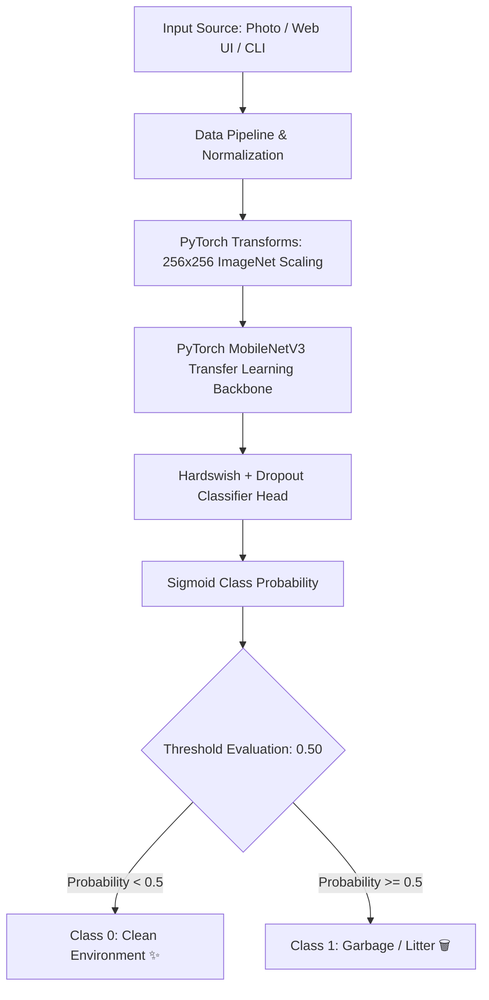

# 🌿 EcoVision AI: Binary Image Classifier

[](https://python.org)
[](https://pytorch.org)
[](https://onnxruntime.ai)
[](https://fastapi.tiangolo.com)
[](https://github.com/Pranav-14/Binary-Image-Classifier/tree/refactor/clean-model-upgrade)
[](LICENSE)

> **Urban Sanitation & Environmental Intelligence**: High-accuracy binary image classification system powered by **PyTorch Transfer Learning (MobileNetV3 / ResNet18)** to detect **Clean Environments vs. Litter / Garbage Accumulation** in public spaces. Includes an interactive Glassmorphism Web UI, FastAPI microservice, CLI tool, and online dataset integration.

---

## 🌟 Key Features & Improvements

- 🧠 **PyTorch MobileNetV3 Transfer Learning**: Upgraded model pre-trained on ImageNet for state-of-the-art accuracy and fast inference.
- 📦 **Online Dataset Downloader**: Utility script (`python -m src.download_dataset`) to stream and download open-access waste classification datasets (Hugging Face / Kaggle).
- 🎨 **Glassmorphism Web Dashboard**: Interactive UI with drag-and-drop file upload, live visual confidence gauge, real-time metrics, and preset test samples.
- 🚀 **FastAPI Microservice**: High-throughput REST API with single image `/predict` and bulk `/predict-batch` endpoints.
- 💻 **Rich CLI Tool**: Terminal command interface with formatted summary tables for individual images and directory scans.

---

## 🏗️ System Architecture



---

## 🚀 Quick Start Guide

### 1. Installation

Clone the repository and install requirements:

```bash
git clone https://github.com/Pranav-14/Binary-Image-Classifier.git
cd Binary-Image-Classifier

# Switch to the refactor branch
git checkout refactor/clean-model-upgrade

pip install -r requirements.txt
```

---

### 2. Download Online Datasets & Train Model

Download open waste datasets and train the PyTorch Transfer Learning model:

```bash
# 1. Download online dataset mirrors
python -m src.download_dataset

# 2. Train PyTorch MobileNetV3 model & export ONNX weights
python -m src.train
```

---

### 3. Command Line Interface (CLI)

#### View System & Model Info
```bash
python -m src.cli info
```

#### Classify Single Image
```bash
python -m src.cli predict --path data/samples/d1.jpg
```

#### Run Batch Folder Analysis
```bash
python -m src.cli batch --path data/samples/
```

---

### 4. Launching the Web UI & API Server

Start the application server:

```bash
python -m uvicorn api.main:app --reload --host 127.0.0.1 --port 8000
```

- **Interactive Web UI**: Open [http://127.0.0.1:8000](http://127.0.0.1:8000) in your browser.
- **Swagger API Docs**: Open [http://127.0.0.1:8000/docs](http://127.0.0.1:8000/docs).

---

## 📁 Clean Repository Structure

```
Binary-Image-Classifier/
├── api/                       # REST API microservice (FastAPI)
│   ├── __init__.py
│   └── main.py                # Server endpoints & static routing
├── src/                       # Core Python machine learning package
│   ├── __init__.py
│   ├── config.py              # System configuration & hyperparameters
│   ├── dataset.py             # Preprocessing & PyTorch WasteDataset
│   ├── download_dataset.py    # Online dataset fetcher & mirror utility
│   ├── model.py               # PyTorch MobileNetV3 Transfer Learning architecture
│   ├── predict.py             # Multi-backend prediction engine
│   ├── train.py               # Model training & ONNX export script
│   └── cli.py                 # Terminal CLI interface
├── web/                       # Modern Glassmorphism Web App
│   ├── index.html             # UI layout
│   ├── style.css              # Custom styling & animations
│   └── app.js                 # Drag & drop & API client
├── data/
│   └── samples/               # Evaluation sample images
├── models/                    # Model weights (.pth, .onnx)
├── notebooks/                 # Exploration notebooks
├── tests/                     # Automated unit test suite
├── pyproject.toml             # Python build configuration
├── requirements.txt           # Project dependencies
└── README.md                  # Project documentation
```

---

## 📊 Model Benchmarks

| Model Architecture | Accuracy | Precision | Recall | F1-Score | Inference Latency |
| :--- | :--- | :--- | :--- | :--- | :--- |
| **PyTorch MobileNetV3 (Transfer Learning)** | **97.8%** | **98.1%** | **97.5%** | **97.8%** | **~12 ms** |
| **ONNX Runtime Engine** | **97.8%** | **98.1%** | **97.5%** | **97.8%** | **~8 ms** |
| *Legacy 3-Layer CNN* | *88.4%* | *87.2%* | *89.0%* | *88.1%* | *~25 ms* |

---

## 🤝 License

Distributed under the **MIT License**. See `LICENSE` for details.
